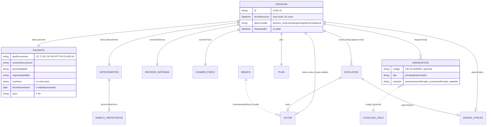

# Mapeo del repositorio para el RDA (Fase 1)

Base: commit `ecc16a4` (rama de trabajo `claude/new-session-04jvxz`, ver [DESVIACIONES.md](DESVIACIONES.md) §G1). Todo lo que sigue tiene evidencia `ruta:línea` del código en esa base.

## 1. Stack y línea base

| Aspecto | Hallazgo | Evidencia |
| --- | --- | --- |
| Lenguaje y versión | Dart 3.10.9 sobre Flutter 3.38.10 (stable) | `pubspec.yaml:7`, `README.md` («Requisitos»), `.github/workflows/ci.yml` (`flutter-version: 3.38.10`) |
| Framework | Flutter (Material) + Riverpod 3 (estado) + go_router (rutas) | `pubspec.yaml:15-17`, `lib/app/router.dart` |
| Plataformas | **Solo web (PWA)**. No hay `android/`, `ios/`, `linux/`, `macos/` ni `windows/` | árbol del repo; `docs/PLAN.md` decisión 22 |
| Backend de servidor | **No existe.** «Sin servidor, sin base de datos y sin conexión tras la primera carga» | `README.md:3` |
| ORM / migraciones / BD relacional | No hay. Persistencia local: `shared_preferences` (localStorage) e IndexedDB (solo el CIE-10 importado) | `lib/core/storage/preferencias.dart:7`, `lib/core/cie10/almacen_cie10_web.dart:7-9` |
| Registro clínico | El **PDF** que descarga el médico, con `historia.json` incrustado y cadena SHA-256 | `README.md:3`, `lib/core/pdf/adjunto_historia.dart`, `lib/core/integridad/cadena_hash.dart:49` |
| Cola / scheduler | No hay | — |
| Cliente HTTP | Ninguno directo; `http` 1.6.0 es transitiva (vía `printing`) | `pubspec.lock` (`http: dependency: transitive`) |
| Configuración | Constantes en código y `SharedPreferences`; no hay `--dart-define` ni `.env` | `lib/core/storage/preferencias.dart:12-24` |
| Secretos | No hay secretos ni `flutter_secure_storage` | `pubspec.yaml` |
| Criptografía | `crypto` 3.0.7 (solo hashes SHA-256) | `lib/core/integridad/cadena_hash.dart`, `lib/core/models/medico.dart:120` |
| JSON canónico | Propio (claves ordenadas, solo ASCII) — no es RFC 8785 | `lib/core/integridad/json_canonico.dart` |
| Logging / auditoría | No hay logger ni bitácora; mensajes al usuario por `SnackBar` | `lib/features/historia/historia_page.dart:121-133` |
| Multi-tenant | No: un médico por navegador | `lib/core/models/medico.dart:9-11` |
| Generador de PDF | `pdf` 3.12.0 + `printing` 5.14.3; `generarPdfHistoria` | `lib/core/pdf/historia_pdf.dart:34` |
| Pruebas | `flutter_test`; 191 pruebas | `test/` |
| Linter / type-checker | `flutter_lints` 6 + `flutter analyze`; `dart format` en CI | `analysis_options.yaml:10`, `.github/workflows/ci.yml` |
| Seguridad del sitio | CSP estricta: la app **solo se conecta a su propio dominio** (`connect-src 'self'`) | `docs/FASE4.md` §4, `web/_headers` |

**Línea base (antes de cualquier cambio):** `dart format --set-exit-if-changed lib test tool` sin cambios; `flutter analyze` sin problemas; `flutter test` **191/191 en verde**.

## 2. Inventario de entidades

No hay tablas: cada entidad es una clase con `aMapa()`/`desdeMapa()` que viaja en el `historia.json` del PDF. La columna «Tabla» indica la clave del mapa (o del almacenamiento local).

| Entidad | Archivo:línea | «Tabla» | Campos clave | Cardinalidad |
| --- | --- | --- | --- | --- |
| Atención / historia inicial | `lib/core/models/historia.dart:116` | `historia.json → datos` (`tipo = historia_clinica`) | `id` (UUID, :173), `fechaAtencion` (:177, minuto, hora local sin zona), `tipoConsulta` (:178), `finalizadaEn` (`historia_controller.dart:113`) | 1 por PDF |
| Paciente | `lib/core/models/paciente.dart:3` | `datos.paciente` | `primerApellido` (:44), `segundoApellido` (:45), `nombres` (:46, un solo texto), `tipoDocumento` (:47), `numeroDocumento` (:48), `fechaNacimiento` (:51) o `edadAproximada` (:52), `sexo` F/M/I (:55), `ciudad` (:58, texto), `ocupacion` (:60, texto), `aseguradora` (:61, texto) | 1 por atención (no hay registro maestro de pacientes) |
| Profesional (médico) | `lib/core/models/medico.dart:11` | `localStorage['hc.medico.v1']` | `nombre` (:50, texto completo con título), `registro` (:54), `documento` (:57, opcional, sin tipo), `especialidad` (:51, texto) | 1 por navegador |
| Copia del profesional en la atención | `lib/core/models/medico.dart:124` (`Autor`) | `datos.medico` | igual que el médico, sellado | 0..1 por atención; 0..1 por evolución |
| Prestador / consultorio | `lib/core/models/medico.dart:58-60` | dentro del médico | `consultorio` (nombre), `direccion`, `ciudad` (texto) | 1 por navegador; **no hay NIT, código de habilitación REPS ni sedes** |
| Motivo y enfermedad actual | `lib/core/models/historia.dart:180-181` | `datos.motivo` | texto libre | 1 |
| Antecedentes | `lib/core/models/antecedentes.dart:90` | `datos.antecedentes` | `alergias` (lista de etiquetas de texto, :117), `niegaAlergias` (:120), `personales`, `medicacionActual`, `quirurgicos`, `familiares`, `habitos` (texto) | 1 |
| Gineco-obstétricos | `lib/core/models/antecedentes.dart:3` | `datos.antecedentes.ginecoObstetricos` | FUM, G/P/C/A/V, gestante | 0..1 |
| Revisión por sistemas | `lib/core/models/revision_sistemas.dart` | `datos.revisionSistemas` | texto por sistema | 1 |
| Signos vitales | `lib/core/models/signos_vitales.dart:7` | `datos.signosVitales` | PA, FC, FR, T°, SpO₂, peso, talla, glucemia, perímetro abdominal (números) | 0..1 por atención y por evolución |
| Examen físico | `lib/core/models/historia.dart:22` | `datos.examenFisico` | texto | 1 |
| Análisis | `lib/core/models/historia.dart:188` | `datos.analisis` | texto | 1 |
| Diagnóstico | `lib/core/models/diagnostico.dart:3` | `datos.diagnosticos[]` | `codigo` CIE-10 (:25, **opcional**), `descripcion` (:22), `tipo` principal/relacionado (:28), `caracter` presuntivo/confirmado_nuevo/confirmado_repetido (:31) | 0..n |
| Plan | `lib/core/models/historia.dart:43` | `datos.plan` | `planTerapeutico`, `examenesSolicitados`, `interconsultas`, `indicaciones` (texto), `proximoControl` (fecha) | 1 |
| Evolución | `lib/core/models/evolucion.dart:7` | `datos.evoluciones[]` | `id`, `fechaHora`, `texto`, signos, `autor`, `hash` | 0..n (append-only, selladas) |
| Receta | `lib/core/receta/receta.dart` | `localStorage['hc.receta.v1']` (no entra a la historia) | ítems de texto libre; numeración `R-000001` | independiente; solo se copia como texto al plan (`historia_controller.dart:168`) |
| Catálogo CIE-10 | `lib/core/cie10/catalogo_cie10.dart:43` | `assets/cie10/cie10_sispro.txt` (12.634 códigos SISPRO, 15/09/2026) o IndexedDB | código → descripción oficial | 1 |
| Procedimientos (CUPS), medicamentos (CUM/IUM/DCI), incapacidades, factores de riesgo, órdenes codificadas, EAPB codificada, sedes | **no existen** | — | — | — |

## 3. Modelo clínico (atención como raíz)

## 4. Cobertura terminológica

| Catálogo | Qué guarda hoy | Versión | Evidencia |
| --- | --- | --- | --- |
| CIE-10 | **Código y nombre** (copia de SISPRO al elegir; el nombre es editable) | Tabla SISPRO 15/09/2026 incluida, o la importada | `lib/core/models/diagnostico.dart:22-25`, `lib/core/cie10/catalogo_incluido.dart` |
| CIE-11, SNOMED CT | No se guardan | — | — |
| CUPS | No se guarda | — | — |
| CUM / IUM / DCI | No: la receta es texto libre | — | `lib/core/receta/receta.dart` |
| Tipo de documento | Código local propio (`CC`, `TI`, …, `MS`, `AS`) | sin versión (VERIFICAR) | `lib/core/pais/perfil_pais.dart:92-103` |
| Sexo | Código local `F`/`M`/`I` | sin versión | `lib/core/pais/perfil_pais.dart:72-76` |
| Tipo y carácter del diagnóstico | Códigos locales (`principal`/`relacionado`; `presuntivo`/`confirmado_nuevo`/`confirmado_repetido`) | «clasificación de RIPS» (VERIFICAR) | `lib/core/pais/perfil_pais.dart:52,85-88,107-111` |
| Tipo de consulta | Código local | sin versión | `lib/core/pais/perfil_pais.dart:78-83` |
| Ocupación, aseguradora, municipio, alergias, exámenes e interconsultas | **Texto libre** | — | `lib/core/models/paciente.dart:58-61`, `lib/core/models/antecedentes.dart:117`, `lib/core/models/historia.dart:61-62` |

## 5. Tipos de atención y RDA aplicables

| Tipo de atención | ¿Lo soporta el producto? | RDA | Decisión |
| --- | --- | --- | --- |
| Consulta ambulatoria (primera vez, control, interconsulta) | Sí: historia inicial (`tipoConsulta`) | **Consulta externa (P0)** | Se emite al finalizar la historia |
| Evolución / control posterior | Sí, pero solo texto, signos y autor (sin diagnósticos codificados) | Consulta externa | Brecha: sin diagnóstico CIE-10 por evolución no se cumple `sectionProblems 1..*`. Punto de extensión documentado |
| Urgencias | Solo como etiqueta `tipoConsulta = urgencia`; sin triage, ingreso ni egreso | Urgencias (P1) | Brecha: faltan triage, vía de ingreso, egreso. Punto de extensión |
| Hospitalización | No | Hospitalización (P1) | Brecha total. Punto de extensión |
| Resumen del paciente | Parcial (antecedentes de texto) | Paciente (P1) | Brecha: antecedentes no codificados. Punto de extensión |

## 6. Frontera presentación/servicios y punto de enganche

- **Presentación:** `lib/features/**/**_page.dart`, `lib/features/**/secciones/`, `lib/features/**/widgets/`, `lib/core/widgets/`, tema en `lib/app/tema.dart`.
- **Estado y servicios:** `lib/features/**/estado/` y `*_provider.dart` (Riverpod), `lib/core/**` (modelos, PDF, integridad, almacenamiento).
- **Cierre de la atención:** la página llama, tras escribir el PDF, a `HistoriaController.guardado(...)` — `lib/features/historia/historia_page.dart:383`; el método vive en la capa de estado: `lib/features/historia/estado/historia_controller.dart:156`. Ahí se engancha la outbox (capa de estado), con los datos ya sellados (`DatosParaGuardar`, `historia_controller.dart:18`). La revisión 1 es el cierre de la historia inicial; las siguientes son evoluciones.
- **Pantalla del prestador:** «Datos del médico» (`lib/features/medico/medico_page.dart:26`), tarjetas «Datos profesionales» (:72) y «Consultorio» (:144).
- **Patrón de campos a copiar:** `CampoTexto`, `CampoDesplegable`, `FilaCampos` (`lib/core/widgets/campos.dart:17,522,676`); botones `FilledButton`/`OutlinedButton` del tema. **No se modifican** `lib/app/tema.dart` ni los widgets base.

## 7. Texto libre frente a dato estructurado

| Capturado como dato estructurado o codificado | Capturado como texto libre |
| --- | --- |
| Tipo y número de documento, apellidos separados, fecha de nacimiento, sexo, fecha y hora de la atención, tipo de consulta, CIE-10 (código opcional), tipo y carácter del diagnóstico, signos vitales numéricos, fórmula G/P/C/A/V, FUM, `niegaAlergias` | Nombres (un solo campo), ciudad, dirección, ocupación, aseguradora, alergias (etiquetas), antecedentes, motivo, enfermedad actual, revisión por sistemas, examen físico, análisis, plan, exámenes solicitados, interconsultas, indicaciones, evoluciones, receta, nombre completo del médico, consultorio |

Esta tabla es la base de las brechas de [MATRIZ_RDA.md](MATRIZ_RDA.md) y de los campos que añade la regla 10 ([CAMBIOS_UI.md](CAMBIOS_UI.md)).
