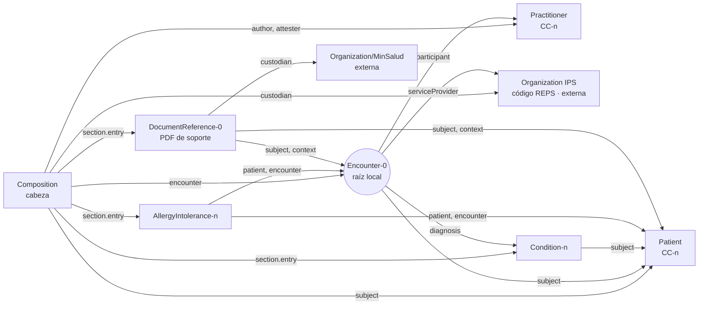
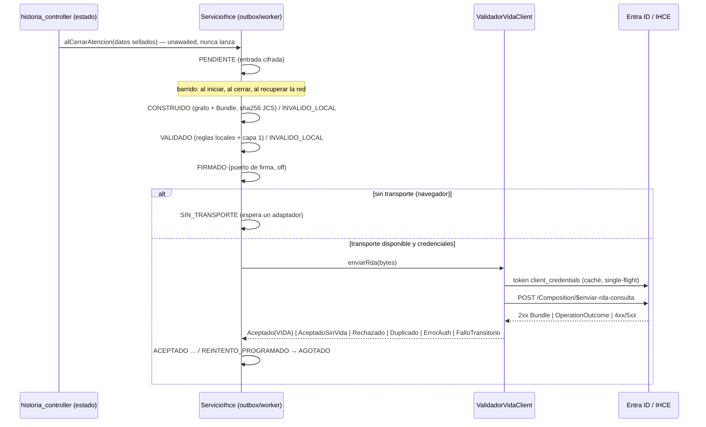

# Módulo IHCE / RDA (Resolución 1888 de 2025)

Generación, validación y transmisión del **Resumen Digital de Atención (RDA)** de consulta externa a la Interoperabilidad de la Historia Clínica Electrónica (IHCE) de MinSalud, con captura del identificador **VIDA**. Guía de implementación FHIR R4 `minsalud.fhir.co.rda` («Vulcano»), fijada por huella en `vendor/fhir/VERSIONS.lock`.

**Bandera:** `IHCE_ENABLED` (apagada por defecto). Apagada, la app se comporta exactamente como antes: no se crea el servicio, no se lee el almacén de secretos y ningún widget del módulo se muestra (T13, T23).

Documentos: [MAPEO_REPOSITORIO.md](MAPEO_REPOSITORIO.md) · [MATRIZ_RDA.md](MATRIZ_RDA.md) · [PERFILES_RDA.md](PERFILES_RDA.md) · [DESVIACIONES.md](DESVIACIONES.md) · [CAMBIOS_UI.md](CAMBIOS_UI.md) · [REPORTE_MINSALUD.md](REPORTE_MINSALUD.md) · [validation-baseline.json](validation-baseline.json) · plantilla [`config/ihce.env.example`](../../config/ihce.env.example).

## Alcance

| Prioridad | Estado |
| --- | --- |
| **P0** RDA de consulta externa de punta a punta (grafo, adaptador FHIR, validación local, cliente, outbox, VIDA) | Implementado y probado con mocks (T01–T24). Envío real pendiente de credenciales, sandbox y transporte (ver «Salida a producción») |
| P1 urgencias, hospitalización, resumen del paciente | Puntos de extensión (`EstrategiaPendiente`, `TipoRda`); el producto no captura esos datos |
| P1 operaciones de consulta (`$consultar-paciente-exacto`, terminología, listados) | En `ValidadorVidaClient`, probadas con mocks; sin uso en la interfaz |
| P1 nota aclaratoria | Punto de extensión (`enviarNotaAclaratoria`), sin implementar |
| P1 sincronización de terminología en línea | `SincronizadorTerminologia` (mocks). P0: importación desde archivo (`ImportadorCatalogo`) |

## Arquitectura

La app es una PWA Flutter sin servidor: la historia es un PDF con `historia.json` embebido. El módulo vive en `lib/core/ihce/` (sin dependencias de UI) y se engancha en la capa de estado (`historia_controller.dart`, ver [CAMBIOS_UI.md](CAMBIOS_UI.md)).

| Capa | Ruta | Responsabilidad |
| --- | --- | --- |
| Configuración | `config/config_ihce.dart` | `ConfigIhce` desde `--dart-define` (nunca secretos) |
| Secretos | `secretos/almacen_secretos.dart` | `AlmacenSecretos` → `flutter_secure_storage`; credenciales por ambiente y llave AES de datos |
| Almacén | `almacen/` | Clave → texto (IndexedDB `historiasclinicas_ihce` en la web), `RepositorioIhce` con índices, únicos y migración reversible |
| Cifrado | `cifrado/cifrador.dart` | AES-256-GCM de entradas, Bundles y grafo en reposo |
| Extracción | `extraccion/` | Instantánea sellada de la atención (`EntradaAtencion`) → DTO normalizados (NFC) |
| Terminología | `terminologia/` | Catálogo de la guía (`assets/ihce/catalogos_guia.json`), CIE-10 SISPRO (D6), equivalencias locales, importación |
| Identidad | `identidad/validador_identidad.dart` | `OK / ADVERTENCIA / BLOQUEO` por tabla (T19) |
| Grafo | `grafo/` | Nodos (recursos) y aristas (referencias); `Encounter` = raíz local, `Composition` = cabeza |
| Mappers | `mappers/` | DTO → recursos de los perfiles; valores fijos leídos de los artefactos (`perfiles/perfiles_rda.g.dart`, generado) |
| Ensamblado | `ensamblado/` | `Composition` + `Bundle` de consulta (D1–D3, D8), PDF de soporte |
| Validación | `validacion/` | Reglas locales R01–R13 y capa 1 (JSON Schema FHIR R4) antes de cualquier envío |
| Cliente | `cliente/` | `ValidadorVidaClient`: OAuth 2.0, transporte, `OperationOutcome`, resultados tipados, logs redactados |
| Outbox | `outbox/servicio_ihce.dart` | Máquina de estados, worker, reintentos, idempotencia, bitácora, reconciliación |
| Interfaz | `lib/features/ihce/` | Providers y campos mínimos (regla 10) |

### Grafo clínico de una atención



Cada nodo guarda su recurso, perfil, tabla y PK de origen; un rechazo con `location` se resuelve al nodo y, por él, al dato de origen (T05). El VIDA aceptado se enlaza a la atención (raíz).

### Flujo



### Máquina de estados

`PENDIENTE → CONSTRUIDO → VALIDADO → FIRMADO → ENVIANDO | SIN_TRANSPORTE`; `ENVIANDO → ACEPTADO | ACEPTADO_SIN_VIDA | RECHAZADO | DUPLICADO | ERROR_AUTH | REINTENTO_PROGRAMADO | AGOTADO`; `REINTENTO_PROGRAMADO → ENVIANDO | SIN_TRANSPORTE`; `ERROR_AUTH → REINTENTO_PROGRAMADO` (solo al guardar credenciales nuevas). Cualquier etapa local puede ir a `INVALIDO_LOCAL` o `ERROR_INTERNO`. Las transiciones están en `EstadoDocumento.puedePasarA` (`modelo/documento_rda.dart`); una transición no prevista lanza y el documento queda en `ERROR_INTERNO`.

## Configuración

Valores no secretos compilados con `flutter build web --dart-define-from-file=<archivo>` a partir de [`config/ihce.env.example`](../../config/ihce.env.example) (todas vacías = valores por defecto; bandera apagada). Lo compilado en la PWA es público: **no existen** variables para ClientID, ClientSecret ni clave de suscripción.

Secretos: se escriben en «Datos del médico → Consultorio» (**ClientID de MinSalud**, **ClientSecret de MinSalud**, Clave de suscripción de MinSalud) y se guardan solo en `flutter_secure_storage`, por ambiente (`ihce.<ambiente>.client_id`, …). La llave AES de los datos en reposo se genera en el equipo y vive en el mismo almacén. Con el almacén vacío el módulo queda inactivo sin errores: los documentos esperan en la cola (T22).

En la web, `flutter_secure_storage` usa WebCrypto sobre `localStorage` (solo HTTPS, atado al dominio y al navegador): protege frente a lectura casual, no frente a código que corra en el mismo origen. Es otra razón para el relevo de servidor (ver «Transporte»).

## Operación del worker

- **Cuándo corre:** al iniciar la app, después de cada cierre de atención y al recuperar la conectividad. Barridos simultáneos se unen en uno.
- **Qué hace en cada barrido:** reconcilia cierres sin documento, procesa los documentos listos (`PENDIENTE`…`FIRMADO`, `SIN_TRANSPORTE`, `REINTENTO_PROGRAMADO` vencidos y `ENVIANDO` huérfanos) en orden de creación y depura la bitácora (`IHCE_RETENCION_BITACORA_DIAS`, 730 por defecto).
- **Aislamiento:** ninguna excepción sale hacia la interfaz. Una excepción no prevista deja ese documento en `ERROR_INTERNO` (con traza redactada en el log) y el worker sigue con el siguiente (T13).
- **Idempotencia:** el Bundle se canonicaliza (RFC 8785) y se identifica por SHA-256; los reintentos envían los mismos bytes. Un Bundle ya aceptado con el mismo sha no se reenvía; `409` → `DUPLICADO` sin reintento. Únicos del repositorio: (tenant, atención, tipo, versión), VIDA y un solo `ACEPTADO` por (atención, tipo).
- **Token:** caché por (tenant, ambiente, scope) con 90 s de margen, una sola petición concurrente; `401` → una renovación y un reintento.
- **Concurrencia y protección:** hasta `IHCE_CONCURRENCIA_TENANT` conexiones por host; cortacircuitos tras `IHCE_CORTACIRCUITOS_UMBRAL` fallos transitorios seguidos (espera `IHCE_CORTACIRCUITOS_ESPERA_S`); alertas por picos de 4xx, 409 y 5xx (10 en 10 minutos).
- **Logs:** solo identificadores internos, correlación, estado, HTTP y hashes. Nunca nombres, documentos, tokens, secretos ni payloads FHIR (T15, T22).

## Reintentos y conciliación

| Estado | Qué significa | Qué hacer |
| --- | --- | --- |
| `REINTENTO_PROGRAMADO` | `429`, `5xx`, timeout o conexión caída | Nada: espera `min(TOPE, BASE·2^(n-1))` + hasta 10 % de jitter (`Retry-After` manda). Base 30 s, tope 1 h |
| `AGOTADO` | `IHCE_MAX_INTENTOS` (6) fallos transitorios | La línea de estado de la historia ofrece **Reintentar** (nueva `version_doc`); antes, revisar la conectividad o el estado de IHCE |
| `SIN_TRANSPORTE` | No hay adaptador de red (navegador) | Registrar un relevo (`registrarTransporte`); se envía sin reconstruir (T21) |
| `ERROR_AUTH` | `401` persistente o `403` | Corregir las credenciales en «Consultorio»: al guardar, los documentos vuelven a la cola y se envían sin reconstruirse |
| `INVALIDO_LOCAL` | Falta un dato obligatorio, un código no está en el catálogo (también en diagnósticos relacionados) o una sección tiene contenido sin codificar (medicación actual, fórmula, órdenes, ocupación, aseguradora, hábitos, alergias sin tipo; [DESVIACIONES.md](DESVIACIONES.md) D8) | La línea de estado de la historia dice qué falta. Si es un dato corregible, corregir y pulsar **Reintentar** (nueva `version_doc`). El texto libre de una historia sellada no se puede codificar después: ese RDA queda sin enviar hasta que exista captura codificada |
| `RECHAZADO` | `4xx` con `OperationOutcome` (SINTACTICO, SEMANTICO, IDENTIDAD, NEGOCIO) | Ídem. Las issues completas, con su nodo y dato de origen, quedan en el documento. Un rechazo SEMANTICO marca el sistema para sincronizar el catálogo |
| `DUPLICADO` | `409`: la plataforma ya tenía la atención | Conciliar con MinSalud; no se reintenta |
| `ACEPTADO_SIN_VIDA` | `2xx` sin VIDA reconocible (o eco del identificador enviado) | Alerta registrada; consultar el VIDA en la plataforma (`TODO(IHCE-VERIFICAR)` forma de la respuesta) |
| `ERROR_INTERNO` | Defecto del programa o del almacén (p. ej. VIDA repetido) | Revisar el log por el id del documento |

**Reconciliación:** al cerrar una atención se guarda un registro de cierre cifrado; si la inserción en la outbox falla, el siguiente barrido crea el documento a partir de ese registro (T13). Un `ENVIANDO` interrumpido se reenvía con los mismos bytes; si la plataforma ya lo tenía, el `409` lo concilia.

## Transporte

| Plataforma | Adaptador | Estado |
| --- | --- | --- |
| Navegador (la PWA actual) | `TransporteNoDisponible` | Los documentos quedan en `SIN_TRANSPORTE`. Llamar a IHCE desde el navegador exigiría abrir `connect-src` de la CSP (`web/_headers`, `firebase.json`, `vercel.json`), que IHCE permita CORS y exponer el token en el cliente: no se hace |
| Nativo / escritorio / servidor | `TransporteDirectoIo` | TLS 1.3 mínimo y verificación de certificados (T14); hoy el producto no compila para esas plataformas |
| Relevo de servidor (propuesto) | cualquier `TransporteIhce` registrado con `registrarTransporte` | Es la vía para la PWA: un servicio del propietario que reciba el Bundle ya validado, guarde las credenciales en su gestor de secretos y llame a IHCE |

### Relevo de servidor: no construido (cierre 1.4)

El relevo solo se construye si se cumplen **dos** condiciones, y hoy no se cumple ninguna:

1. **Una plataforma con funciones de servidor.** El repositorio publica en GitHub Pages (`.github/workflows/pages.yml`), que solo sirve archivos estáticos. Las configuraciones de Cloudflare Pages (`web/_headers`), Firebase Hosting (`firebase.json`) y Vercel (`vercel.json`) son también de hosting estático: no hay `functions/`, `api/` ni `rewrites` ([DESPLIEGUE.md](../DESPLIEGUE.md)).
2. **Autenticación de usuarios.** La app no tiene cuentas ni sesiones: «No hay servidor propio, base de datos ni cuentas» ([DESPLIEGUE.md](../DESPLIEGUE.md)). Sin sesión, el relevo no sabría qué prestador llama ni con qué credenciales.

Decisiones que necesita el propietario:

- **Plataforma:** p. ej. Cloudflare Pages Functions/Workers (ya hay configuración de Pages), Firebase Cloud Functions, Vercel Functions o un servidor propio. Debe guardar las credenciales de IHCE por prestador en su gestor de secretos.
- **Cuentas:** cómo se autentica el profesional y cómo se asocia a su prestador (código REPS) y a sus llaves de Hércules.
- **Datos clínicos en tránsito por el servidor:** el Bundle contiene datos de salud. Hay que decidir dónde se aloja, qué se registra y la base legal (Ley 1581 de 2012 y Resolución 1888 de 2025).

Con esas decisiones, el relevo es un `TransporteIhce` más: la app lo registra con `registrarTransporte` y la cola sale sin reconstruirse (T21).

### Build de producción con el módulo apagado

`pages.yml` compila sin `--dart-define`, así que `IHCE_ENABLED` queda vacío y el módulo apagado. Además, `tool/construir_web.sh` quita de la compilación los datos del módulo (`assets/assets/ihce/`: JSON Schema de FHIR, 3,4 MB, y catálogos derivados de la guía) cuando la bandera no es `true` (`tool/pwa/datos_ihce.dart`, `test/tool/datos_ihce_test.dart`). El valor se calcula como lo hace Flutter: acepta `--dart-define`, `-D`, `--DartDefines` y `--dart-define-from-file` (`.env` o JSON); entre archivos gana el último, y `--dart-define` prevalece sobre los archivos. Así no se publican, el service worker no los precarga y la app apagada descarga lo mismo que antes. Ningún código los pide con la bandera apagada. Lo que sí queda compilado en `main.dart.js` es el código del módulo, con las constantes de perfil generadas de la guía (`perfiles_rda.g.dart`).

## Gate de verificación (`ihce:verify`)

```bash
tool/ihce/verificar.sh
```

1. Aprovisionamiento por huella (`tool/ihce/fetch_fhir_tooling.sh`; descarga solo artefactos normativos públicos).
2. Suite completa de pruebas (T01–T24 sin red).
3. Capa 1: JSON Schema oficial de FHIR R4 sobre los Bundles generados desde fixtures sintéticos (`build/ihce/bundles/`) y los ejemplos oficiales. Criterio: cero errores.
4. Capa 2: validador oficial de HL7 (`tools/fhir/validator_cli.jar`, `-tx n/a`, perfil `BundleAmbulatoryRDA`) y comparación con la línea base. Criterio: cero `error`/`fatal` fuera de [validation-baseline.json](validation-baseline.json). Sin JRE queda **pendiente** (sale con 3).
5. Regla 10 (`tool/ihce/regla10.dart`).

Estado actual: pruebas, capa 1, capa 2 y regla 10 en verde. La capa 2 excluye solo hallazgos reproducidos en artefactos oficiales, más una excepción aceptada por el propietario (G-SLICE-RESOURCE, defecto del perfil `BundleAmbulatoryRDA`, reportado en [REPORTE_MINSALUD.md](REPORTE_MINSALUD.md); ver [DESVIACIONES.md](DESVIACIONES.md)).

## Dependencias

| Paquete | Uso | Por qué |
| --- | --- | --- |
| `cryptography` ^2.9.0 | AES-256-GCM de los datos del RDA en reposo | `crypto` (ya en el proyecto) solo trae hashes; AES-GCM en Dart puro funciona igual en la web y en nativo |
| `flutter_secure_storage` ^11.2.0 | Credenciales y llave de cifrado | Exigido por la regla 3 |
| `http` ^1.6.0 | Transporte y `MockClient` de las pruebas | Cliente estándar de Dart; permite pruebas sin red |
| `json_schema` ^5.2.2 | Capa 1 antes de cada envío | Validación draft-06 del `fhir.schema.json` oficial, recurso por recurso contra `#/definitions/{tipo}` |

Ninguna es de interfaz. Herramientas fuera de `pubspec.yaml` (no se empaquetan): validador de HL7 (`tools/fhir/validator_cli.jar`, JRE), `curl`, `jq`, `unzip`, `sha256sum`.

## Licencia de la guía

Los artefactos de la guía están bajo **CC BY-NC-SA 4.0**. No se versionan (`vendor/fhir/` está en `.gitignore`, salvo `VERSIONS.lock`), pero sí se versionan derivados de ellos: `lib/core/ihce/perfiles/perfiles_rda.g.dart`, `assets/ihce/catalogos_guia.json` y `docs/ihce/PERFILES_RDA.md`. Con el módulo apagado, la PWA publicada **no** incluye `catalogos_guia.json` (ver «Build de producción con el módulo apagado»), pero sí el código compilado con las constantes de `perfiles_rda.g.dart`; con el módulo encendido se publican ambos. La cláusula «NC» (no comercial) debe evaluarla el propietario antes de encender el módulo en un SaaS. El JSON Schema de FHIR (`assets/ihce/fhir.schema.json`) es CC0.

## Salida a producción

- [ ] Llaves de acceso solicitadas por el delegado administrativo del prestador en *IHCE – Administración de llaves de acceso* (Hércules), para preproducción y producción (Manual de gestión de llaves).
- [ ] `IHCE_BASE_URL`, `IHCE_TENANT_ID` y `IHCE_SCOPE` entregados por MinSalud y configurados (sin secretos) en el archivo de `--dart-define`.
- [ ] Relevo de servidor para la PWA (o build nativo) registrado como transporte; credenciales en su gestor de secretos.
- [ ] Pruebas en el sandbox de preproducción: aceptación con VIDA, cada tipo de rechazo, `401/403`, `409`, `429`; confirmar los `TODO(IHCE-VERIFICAR)` (forma de la respuesta y ubicación del VIDA, `Content-Type`, display CIE-10, clave de suscripción, `x-functions-key`, firma).
- [x] Decisión sobre G-SLICE-RESOURCE: aceptada como excepción (2026-10-05).
- [ ] Enviar [REPORTE_MINSALUD.md](REPORTE_MINSALUD.md) a la mesa de ayuda de IHCE y retirar la excepción cuando la guía se corrija.
- [ ] Revisión de los campos añadidos ([CAMBIOS_UI.md](CAMBIOS_UI.md)) y de la licencia de la guía.
- [ ] Validación con MinSalud del RDA de consulta externa; luego `IHCE_ENABLED=true` en el ambiente correspondiente.
